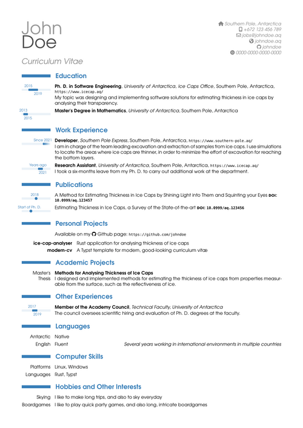

Typst Modern CV
====

A modern Curriculum Vitæ (CV) template with timelines

<https://git.claudiomattera.it/claudiomattera/typst-modern-cv>

This is a template for modern and good-looking CVs.
It was inspired from LaTeX packages [moderncv] and [moderntimeline].

[moderncv]: https://www.ctan.org/pkg/moderncv
[moderntimeline]: https://www.ctan.org/pkg/moderntimeline

Examples
----

There are two example documents in the directory [`docs`](./docs): [`docs/example-underline.typ`](./docs/example-underline.typ) and [`docs/example-lighen.typ`](./docs/example-lighen.typ).

They can be compiled by running the commands

~~~~shell
typst compile --root . ./docs/example-underline.typ
typst compile --root . ./docs/example-lighten.typ
~~~~

The two example documents just set up the page layout and the theme, and then include the same file [`docs/example.typ`](./docs/example.typ).
All entries in the CV are defined in this file.

Usage
----

First, import the package

~~~~typst
// Import all symbols
#import "@local/modern-cv:0.1.0": *

// Or only import selected symbols
#import "@local/modern-cv:0.1.0": conf, update_theme, draw_education, draw_experience, draw_publication
~~~~

Then setup page layout and document metadata.

~~~~typst
#set document(
    title: "John Doe - Curriculum Vitæ",
    author: "John Doe",
)

#set page(
    paper: "a4",
    margin: (x: 1.5cm, y: 1.5cm),
)
~~~~

Then configure the theme.

~~~~typst
#update_theme(
    color: rgb("#377eb8"),
    base_date: datetime(year: 2013, month: 1, day: 1),
    current_date: datetime(year: 2024, month: 1, day: 1),
)
~~~~

Then setup the document.

~~~~typst
#show: doc => conf(
    fullname: "John Doe",
    address: "Southern Pole, Antarctica",
    phone: "+672 123 456 789",
    email: "jobs@johndoe.aq",
    website: "johndoe.aq",
    github: "johndoe",
    orcid: "0000-0000-0000-0000",

    doc,
)
~~~~

Finally, typeset the rest of the document using the provided functions

~~~~typst
#draw_education(
    start: datetime(year: 2015, month: 8, day: 1),
    end: datetime(year: 2019, month: 4, day: 1),
    title: "Ph. D. in Software Engineering",
    institution: "University of Antarctica",
    department: "Ice Caps Office",
    city: "Southern Pole",
    country: "Antarctica",
    url: "https://www.icecap.aq/",
)[
My topic was designing and implementing software solutions for estimating thickness in ice caps by analysing their transparency.
]
~~~~

~~~~typst
#draw_experience(
    start: datetime(year: 2021, month: 2, day: 1),
    finished: false,
    position: "Developer",
    company: "Southern Pole Express",
    city: "Southern Pole",
    country: "Antarctica",
    url: "https://www.southern-pole.aq/",
)[
I am in charge of the team leading excavation and extraction of samples from ice caps.
I use simulations to locate the areas where ice caps are thinner, in order to minimize the effort of excavation for reaching the bottom layers.
]
~~~~

~~~~typst
#draw_publication(
    date: datetime(year: 2018, month: 1, day: 1),
    title: "A Method for Analysing Transparency in Ice Caps by Shining Light into Them and Squinting your Eyes",
    doi: "10.0999/aq.123457",
)
~~~~

The initial and final years will be shown as labels over the timeline.
Custom labels can also be specified with the arguments `label_start`, `label_end` or `label_date`.

Configuration
----

The theme can be configured and customized by calling the function `configure_theme` and passing a dictionary with the following fields.

* `color (color)`: The theme base color (default: `blue`).
* `width (length)`: The width of right bars and timelines (default: `2cm`).
* `thickness (length)`: The thickness of right bars and timelines (default: `1.5mm`).
* `radius (length)`: The radius of rounded corners of timelines (default: `1pt`).
* `style (str)`: The theme style (default: `"underline"`).
* `base_date (datetime)`: The earliest date in all entries (default: `datetime(year: 2005, month: 1, day: 1)`).
* `current_date (datetime)`: The latest date in all entries (default: `datetime.today()`).

All fields are optional; any field that is not specified will not be changed.

### Styles

This template supports two styles: `underline` (default) and `lighten`.

*   Style `underline` shows timelines as coloured intervals above gray underlines, such as the original LaTeX package `moderntimeline`.

    

*   Style `lighten` shows timelines as coloured intervals over full, lightened intervals.

    

Fonts
----

This package uses [Font Awesome] for some icons.

[Download][Font Awesome Download] the Free font pack for Desktop and place the `.otf` files in one of the directories where Typst looks for fonts (or add any directory to the environment variable `TYPST_FONT_PATHS`).

[Font Awesome]: https://fontawesome.com/
[Font Awesome Download]: https://fontawesome.com/download

Changes
----

See the [Changelog](./CHANGELOG.md) for a list of changes.

Development
----

See the [Contributing Guide](./CONTRIBUTING.md) for more information about development.

License
----

Copyright Claudio Mattera 2023-2024

You are free to copy, modify, and distribute this application with attribution under the terms of the [MIT license]. See the [`LICENSE`](./LICENSE) file for details.

[MIT license]: https://opensource.org/license/mit/
